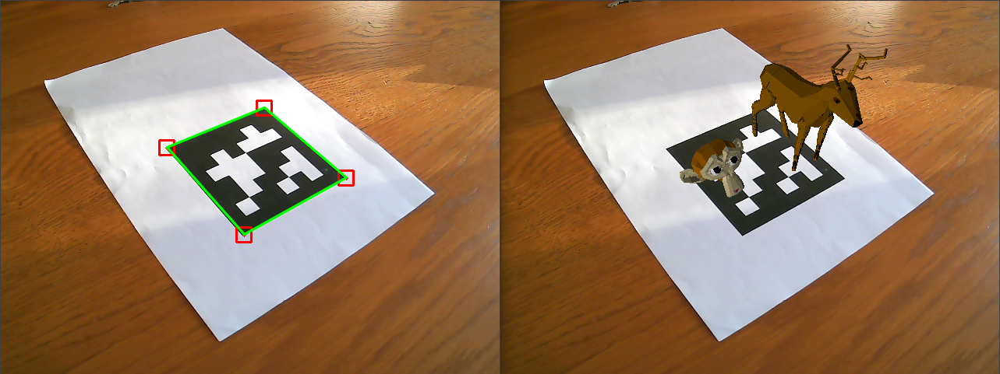
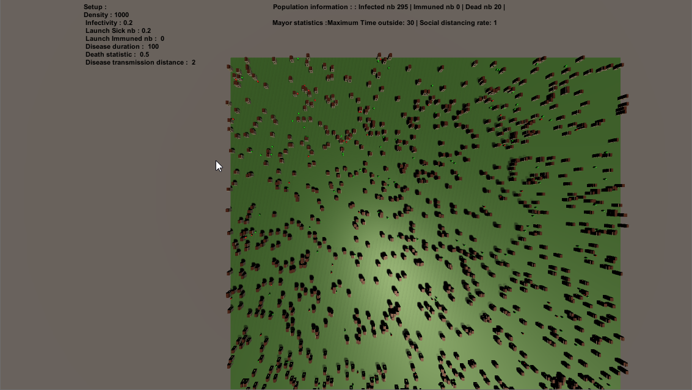

I am a computer science student with a passion for computer vision and computer graphics, which is my major in my engineering school.
[test](test.com)

## Main projects

|Projects|Description|Demonstration|
|---|---|---|
|[My shadertoy profile](https://www.shadertoy.com/user/sperche)| Test project using ray marching algorithm|
|[Augmented reality from scratch](https://github.com/SimonPerche/AugmentedRealityFromScratch)| An augmented reality application from scratch using OpenCV (C++) for learning purpose. It works by recognizing the ARTag on the image, deducing the camera's position and projecting user objects onto the tag. This project was developed with [Nicolas Lépy](https://github.com/nicolasLepy).||
| [Plague Simulator](https://github.com/PlathC/PlagueSimulator) | Learning project which aims to simulate the evolution of a disease inside a defined population using Multi Agent system in Unity. Developed with [Cyprien Plateau--Holleville](https://github.com/PlathC). ||
| Discord bots | I also developed a few Discord bots for entertaining purposes.||

