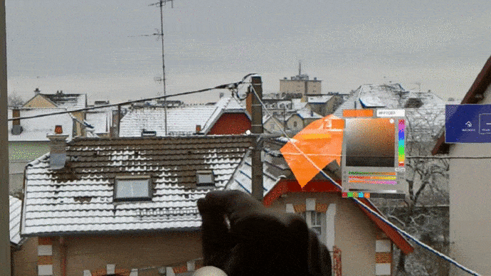

PhD in computer graphics at the LIRIS lab in Lyon - _Interactive control of the style and structure of digital terrains_

## PhD publications

|Name|Abstract|Website|
|---|---|---|
|Vector-based terrain modelling|Vector-based graphics offer numerous advantages over grid-based models, including resolution independence and ease of manipulation. Despite these benefits, their use in landscape modeling remains uncommon because of a lack of direct editing and interactive feedback, essential for matching the artist's vision.We introduce a new vector-based model for creating digital terrains based on computationally efficient primitives. We propose a method to convert grid-based digital elevation maps to this representation with a user-defined level of accuracy.Once vectorized, the terrain can be authored using interactive high-level skeleton-based tools adapted to the primitive representation, allowing local deformations that automatically adapt to underlying geomorphological structures and landforms of the terrain. | [Project page](https://simonperche.github.io/vector-based_terrain_modelling/)   [Journal](https://onlinelibrary.wiley.com/doi/10.1111/cgf.70160)
|Authoring Terrains with Spatialised Style|Various terrain modelling methods have been proposed for the past decades, providing efficient and often interactive authoring tools. However, they seldom include any notion of style, which is critical for designers in the entertainment industry. We introduce a new generative network method that bridges the gap between automatic terrain synthesis and authoring, providing a versatile set of authoring tools allowing spatialised style. We build upon the StyleGAN2 architecture and extend it with authoring tools. Given an input sketch or existing elevation map, our method generates a terrain with features that can be authored, enhanced, and augmented using interactive brushes and style manipulation tools. The strength of our approach lies in the versatility and interoperability of the different tools. We validate our method quantitatively with drainage calculation against other previous techniques and qualitatively by asking users to follow a prompt or freely create a terrain.|[Project page]()   [Code](https://gitlab.liris.cnrs.fr/sperche/authoring-terrains-with-spatialised-style)   [Blender add-on](https://gitlab.liris.cnrs.fr/sperche/styledem-blender-addon)   [Journal](https://onlinelibrary.wiley.com/doi/10.1111/cgf.14936)
|Interactive Authoring of Terrain using Diffusion Models|Generating heightfield terrains is a necessary precursor to the depiction of computer-generated natural scenes in a variety of applications. Authoring such terrains is made challenging by the need for interactive feedback, effective user control, and perceptually realistic output encompassing a range of landforms. We address these challenges by developing a terrain-authoring framework underpinned by an adaptation of diffusion models for conditional image synthesis, trained on real-world elevation data. This framework supports automated cleaning of the training set; authoring control through style selection and feature sketches; the ability to import and freely edit pre-existing terrains, and resolution amplification up to the limits of the source data. Our framework improves on previous machine-learning approaches by: expanding landform variety beyond mountainous terrain to encompass cliffs, canyons, and plains; providing a better balance between terseness and specificity in user control, and improving the fidelity of global terrain structure and perceptual realism. This is demonstrated through drainage simulations and a user study testing the perceived realism for different classes of terrain. The full source code, blender add-on, and pre-trained models are available.|[Journal](https://onlinelibrary.wiley.com/doi/full/10.1111/cgf.14941)

## Student projects

|Projects|Description|Demonstration|
|---|---|---|
|[Augmented reality from scratch](https://github.com/SimonPerche/AugmentedRealityFromScratch)| An augmented reality application from scratch using OpenCV (C++) for learning purpose. It works by recognizing the ARTag on the image, deducing the camera's position and projecting user objects onto the tag. Developed with [Nicolas Lépy](https://github.com/nicolasLepy).||
| [Plague Simulator](https://github.com/PlathC/PlagueSimulator) | Learning project which aims to simulate the evolution of a disease inside a defined population using Multi Agent system in Unity. Developed with [Cyprien Plateau--Holleville](https://github.com/PlathC). ||
|[Holodraw](https://github.com/enzo-bonnot/ARDrawing)|A drawing application using augmented reality technology with Microsoft Hololens and Unity Engine. Developed with [Enzo Bonnot](https://github.com/enzo-bonnot).|
